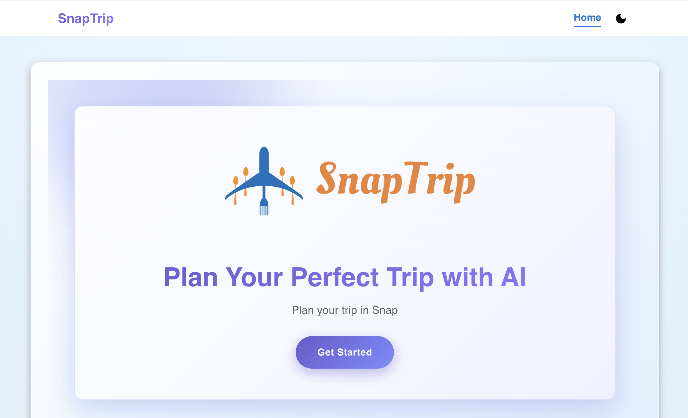
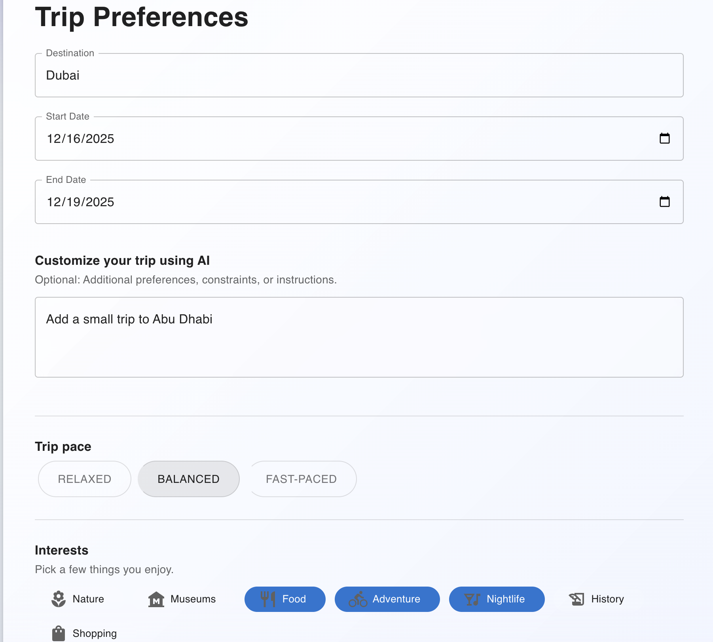
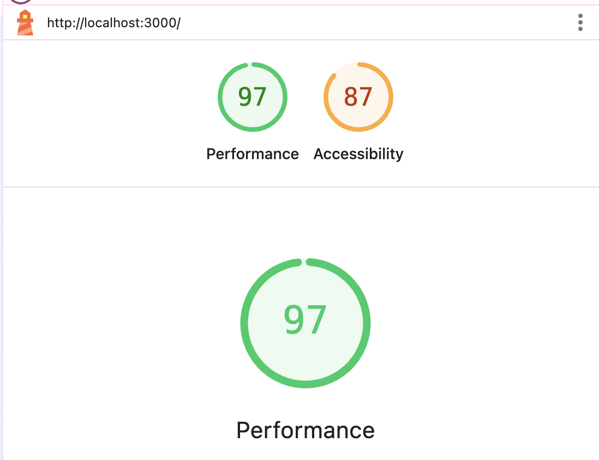
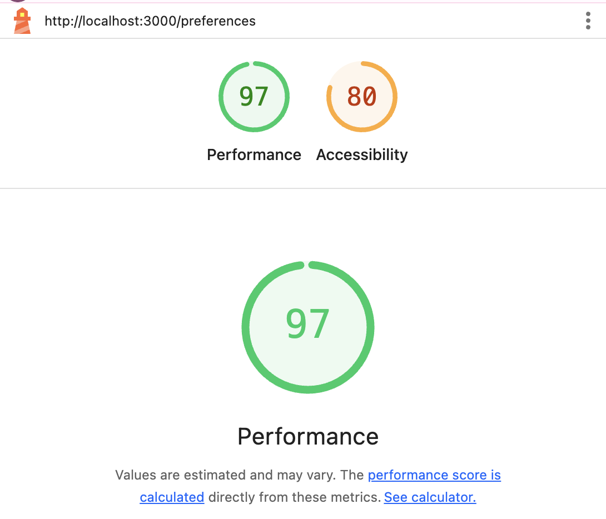

# Getting Started with Create React App

This project was bootstrapped with [Create React App](https://github.com/facebook/create-react-app).

## SnapTrip Overview

SnapTrip is an AI-powered travel planning application that generates multi-day itineraries based on your destination, dates, interests, trip pace, and accessibility preferences. The app includes a guided multi-step flow, AI itinerary generation via a backend server, local trip saving, and PDF export.

## Available Scripts

In the project directory, you can run:

### `npm start`

Runs the app in the development mode.\
Open http://localhost:3000 to view it in your browser.

The page will reload when you make changes.\
You may also see any lint errors in the console.

---

### Running the Backend Server (AI Itinerary Generator)

Navigate into the `server` directory:

```
cd server
npm install
npm start
```

This starts the backend on:\
http://localhost:4000

Create a `.env` file inside the `server` folder:

```
PORT=4000
OPENAI_API_KEY=your-openai-key-here
```

The frontend sends a POST request to:

```
http://localhost:4000/api/itinerary
```


The backend returns an AI-generated itinerary in JSON format.

---

### `npm test`

Launches the test runner in the interactive watch mode.\
See the section about running tests for more information.

### `npm run build`

Builds the app for production to the `build` folder.\
It correctly bundles React in production mode and optimizes the build.\
The build is minified and the filenames include the hashes.

Your app is ready to be deployed!

See the section about deployment for more information.

### `npm run eject`

**Note: this is a one-way operation. Once you eject, you can't go back!**

If you aren't satisfied with the build tool and configuration choices, you can eject at any time. This command will remove the single build dependency from your project.

Instead, it will copy all the configuration files and transitive dependencies so you have full control. All commands except eject will still work, but point to the copied scripts so you can tweak them.

You don't have to ever use eject. The curated feature set is suitable for small and middle deployments.

---

## SnapTrip Features

* Multi-step trip planning flow with guided progress bar  
* AI-generated multi-day itineraries (OpenAI API backend)  
* Destination, dates, pace, interests, and accessibility options  
* Responsive UI built with Material UI + Framer Motion  
* Light and dark theme support  
* Save trips locally using `localStorage`  
* Regenerate itineraries  
* Export itinerary as a PDF using `jspdf`

---

## Screenshots






---

## Metrics (Lighthouse)

Lighthouse scores measured via Chrome DevTools:


```
* Accessibility: 87 / 100
* Performance: 97 / 100
* Accessibility (Preferences Page): 80 / 100
* Performance (Preferences Page): 97 / 100
```




---

## AI Usage

* The backend uses the OpenAI API to generate structured multi-day itineraries.

* ChatGPT was used during development to assist with debugging and documentation.

* All AI-generated suggestions were reviewed, modified, and tested by the team.


---

## Learn More

You can learn more in the Create React App documentation:\
https://facebook.github.io/create-react-app/docs/getting-started

To learn React, visit:\
https://reactjs.org/

### Code Splitting

This section has moved here:\
https://facebook.github.io/create-react-app/docs/code-splitting

### Analyzing the Bundle Size

This section has moved here:\
https://facebook.github.io/create-react-app/docs/analyzing-the-bundle-size

### Making a Progressive Web App

This section has moved here:\
https://facebook.github.io/create-react-app/docs/making-a-progressive-web-app

### Advanced Configuration

This section has moved here:\
https://facebook.github.io/create-react-app/docs/advanced-configuration

### Deployment

This section has moved here:\
https://facebook.github.io/create-react-app/docs/deployment

### `npm run build` fails to minify

This section has moved here:\
https://facebook.github.io/create-react-app/docs/troubleshooting#npm-run-build-fails-to-minify

---

## Authors

* Mehul
* Shantanu  
* Adityaraj  
* Rishabh  


